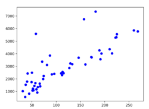
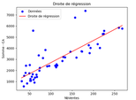
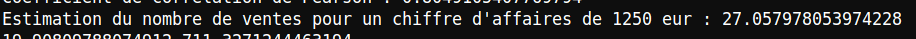

# Analyse du Nuage de Points

## 1. Nuage de Points
Le nuage de points représentant le chiffre d'affaires (**CA**) en fonction du nombre de ventes (**NbVentes**). Chaque point bleu correspond au nombre de ventes et du chiffre d'affaires.

## 2. Observations sur la Distribution des Points
On observe une tendance générale à la hausse, ce qui signifie que lorsque le nombre de ventes augmente, le chiffre d'affaires tend également à augmenter. Les points sont dispersés autour d'une ligne droite, suggérant une relation linéaire entre les deux variables. Cependant, certains points s'écartent de cette tendance, indiquant des situations particulières ou des anomalies.

## 3. Modèle Proposé

Un modèle de régression linéaire est proposé pour expliquer la relation entre le nombre de ventes et le chiffre d'affaires. Ce modèle est justifié par la tendance linéaire observée dans le nuage de points. L'équation de régression est : 
**CA = [a * x + b for x in X]**

Où :
- **\(a\)** : La pente de la droite de régression
- **\(b\)** : L'ordonnée à l'origine

Les valeurs de \(a\) et \(b\) sont les suivantes :
- **\(a = 19.908\)**
- **\(b = 711.327\)**

Ainsi, la fonction complète est :
**CA = 19.908 x + 711.327**

## 4. Estimation du Nombre de Ventes pour un CA de 1250 euros

En utilisant le modèle de régression linéaire, nous pouvons estimer le nombre de ventes nécessaires pour atteindre un chiffre d'affaires de 1250 euros. L'estimation est calculée selon la formule suivante qui est de 27 :
**nb_ventes_estime = (chiffre_affaires - b) / a**

Où :
- **\(chiffre\_affaires = 1250\)**
- **\(a = 19.908\)**
- **\(b = 711.327\)**

## 5. Pertinence et Limites du Modèle

Le modèle de régression linéaire est simple et facile à interpréter, ce qui le rend utile pour une première analyse de la relation entre le nombre de ventes et le chiffre d'affaires. En revanche, il présente des incertitudes certaines limites. Il ne prend pas en compte la dispersion des points autour de la ligne de régression et peut être influencé par des valeurs qui n’ont aucun sens. De plus, il suppose une relation linéaire, ce qui peut ne pas être toujours vrai, surtout si des facteurs externes influencent le CA de manière non linéaire.

