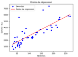

#### NOM : MAKHLOUF  PRENOM : ZAKARIA     GROUPE : 3
# Rapport S2.04 - Exploitation d’une base de données

## Synthèse  
En dépit des difficultés rencontrées, nous avons pu compléter et rendre tous les fichiers requis pour mener à bien ce projet. De plus, nous avons intégré Git, une façon de travailler que je devais inclure dans ce projet suite à des expériences précédentes. Cela nous a permis d’avoir une gestion des versions et de faciliter la collaboration.  

## Analyse  
Nous avons rencontré des difficultés avec la requête du graphique 2. J’ai eu du mal à regrouper les sous-thèmes par rapport à `iddwey`. J’ai constaté que les chiffres des centaines, donc les premiers chiffres en partant de la gauche, représentaient des thèmes distincts. Pour y remédier, j’ai utilisé la commande SQL `CASE WHEN` pour définir un thème spécifique à chaque `iddwey`. La documentation du site [sql.sh](https://sql.sh/cours/case) m’a aidé à comprendre cette logique.  

Nous avons aussi rencontré un problème avec SQLAlchemy, notamment l’erreur :  
```python
AttributeError: 'str' object has no attribute '_execute_on_connection'
```
SQLAlchemy attendait un objet exécutable au lieu d'une simple chaîne de caractères. Pour résoudre ce problème, j’ai encapsulé la requête dans la fonction execute avec :  
```python
from sqlalchemy.sql import text  
requete = text(requete)  
```  

## Nouvelles notions apprises  

- **SQL - `CASE WHEN`** :  
  ```sql
  CASE WHEN LEFT(iddewey, 1) = '0' THEN 'Informatique, généralités'
  [...]  
  END
  ```  
- **Python** :  
  - Définir le formatage des dates avec `strftime("%d/%m/%Y")`.  
  - Formater un nombre flottant avec 2 chiffres après la virgule :  
    ```python
    f"{total_commande:.2f}"
    ```  
- **Git** :  
  Lors de la fusion avec `git pull` du fichier `sae2025.sql`, j’ai rencontré un conflit. J’ai dû le résoudre manuellement avant de valider avec les commandes :  
  ```bash
  git add sae2025.sql  
  git commit -m "Résolution des conflits dans sae2025.sql"
  ```  

## Démonstration de compétence  
Les compétences utilisées lors de cette SAE :  
- **R2.06 - Exploitation d’une base de données** : Utilisation des fonctions d’agrégat, des vues et des requêtes `SELECT`, ainsi que l’affichage des valeurs nulles.  
- **R2.08 - Outils numériques pour les statistiques descriptives** : Réalisation de graphiques statistiques comme vu en TP. J’ai utilisé **NumPy et Matplotlib** pour calculer et visualiser les tendances, notamment avec **la droite de régression** pour analyser l’évolution des ventes en fonction du chiffre d'affaires.



